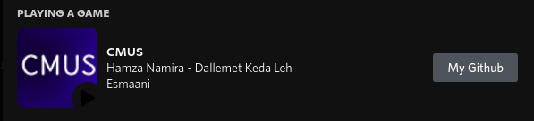
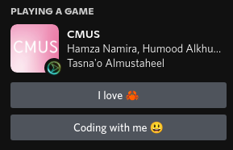

# A Discord Rich Presence for the cmus player with 🦀

[](https://crates.io/crates/cmus-rpc-rs)
[](https://app.codacy.com/gh/anas-elgarhy/cmus-rpc-rs?utm_source=github.com&utm_medium=referral&utm_content=Anas-Elgarhy/cmus-rpc&utm_campaign=Badge_Grade_Settings)
[](https://www.codefactor.io/repository/github/anas-elgarhy/cmus-rpc)




## Dependencies
- Require [cmus](https://cmus.github.io/)

## Installation

- Install from crates.io
    ```bash
    cargo install cmus-rpc-rs
    ```
- Install from aur
    ```bash
    yay -S cmus-rpc-rs
    ```


## Options:

| Option                       | Description                                                  | Values                                                                                    |
| ---------------------------- | ------------------------------------------------------------ | ----------------------------------------------------------------------------------------- |
| `-h` or `--help`             | Shows the help                                               | -                                                                                         |
| `-V` or `--version`          | Shows the version                                            | -                                                                                         |
| `-d` or `--debug`            | Debug mode                                                   | -                                                                                         |
| `-l` or `--link`             | Links with cmus (closes the program if cmus is not running)  | -                                                                                         |
| `-c` or `--config`           | Set the custom path to the config file                       | Path to config file .json                                                                 |
| `-i` or `--interval`         | Set the interval between checks                              | Interval time (seconds)                                                                   |
| `-s` or `--sleep`            | Set the time to sleep when there is no activity              | Sleep time (seconds)                                                                      |
| `--p1f` or `--partOneFormat` | Set the format for the first part                            | Format for first part                                                                     |
| `--p2f` or `--partTowFormat` | Set the format for the second part                           | Format for second part                                                                    |
| `--li` or `--largeImage`     | Set custom large image (cover) for presence                  | Large image name [Available images for default app](./assets/cover/)                      |
| `--pi` or `--playingImage`   | Set custom playing image for presence                        | Playing icon name [Available playing images for default app](./assets/play_icons/)        |
| `--pai` or `--pausedImage`   | Set custom paused image for presence                         | Paused icon name [Available icons](./assets/pause_icons/)                                 |
| `--pt` or `--playingText`    | Set custom playing icon alt for presence                     | Playing icon alt text                                                                     |
| `--pat` or `--pausedText`    | Set custom paused icon altarnative for presence              | Paused icon alt text                                                                      |
| `--b1t` or `--buttonOneText` | Set button one text (label)                                  | Button one label (if empty and has no value in the config file the button will be hidden) |
| `--b1u` or `--buttonOneUrl`  | Set button one url                                           | Button one url (if empty and has no value in the config file the button will be hidden)   |
| `--b2t` or `--buttonTwoText` | Set button two text (label)                                  | Button one label (if empty and has no value in the config file the button will be hidden) |
| `--b2u` or `--buttonTwoUrl`  | Set button two url                                           | Button one url (if empty and has no value in the config file the button will be hidden)   |

## Examples:

```bash
cmus-rpc-rs --p1f %title%
```

```bash
cmus-rpc-rs --p1f "%artist% - %title%" --p2f "%album% - %date%"
```

```bash
cmus-rpc-rs --p1f "Anas listening to %title%" --p2f "From %artist%"
```

## How to do auto run when you start the cmus

- Put the following line in your shellrc file e.g. `.bashrc` or `.zshrc`

```bash
    alias cmus = 'cmus-rpc-rs --link &>/dev/null & cmus'
```

## Available at

[](https://github.com/anas-elgarhy/cmus-rpc-rs)
[](https://gitlab.com/anas-elgarhy/cmus-rpc-rs)
[](https://bitbucket.org/anas_elgarhy/cmus-rpc-rs)
[](https://codeberg.org/anas-elgarhy/cmus-rpc-rs)

## Resources

- [`cmus-remote` tool](https://github.com/cmus/cmus) To be able to make a query to the cmus
- [Discord Rich Presence](https://github.com/nickofolas/discord-rich-presence) A simple, cross-platform crate for interfacing with Discord's IPC.
- [dirs-rs](https://github.com/dirs-dev/dirs-rs) A low-level library that provides config/cache/data paths, following the respective conventions on Linux, macOS and Windows.
- [clap](https://github.com/clap-rs/clap) A full featured, fast Command Line Argument Parser for Rust.

[](https://sonarcloud.io/summary/new_code?id=Anas-Elgarhy_cmus-rpc)

[](https://sonarcloud.io/summary/new_code?id=anas-elgarhy_cmus-rpc-rs)

> This is my first project using rust 😆, support me with star yoo 💙🦀

[](https://spdx.org/licenses/MIT.html)
[](https://spdx.org/licenses/MIT.html)
